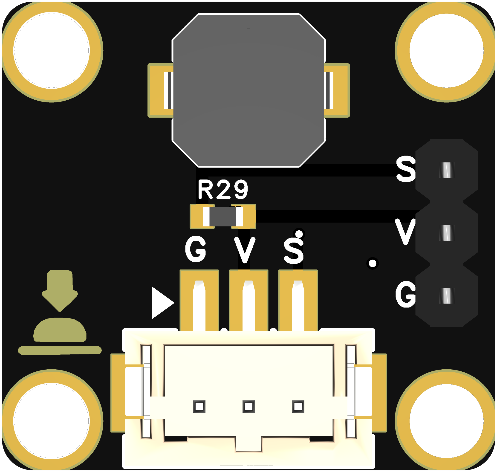
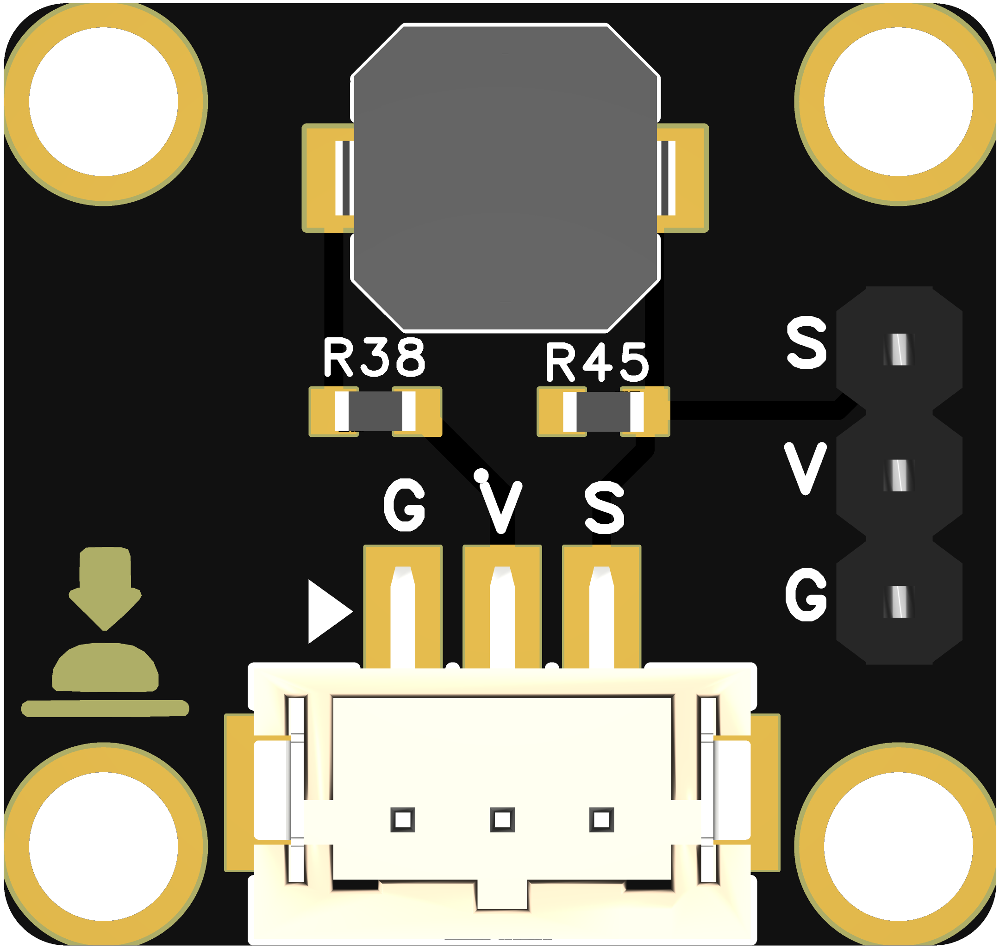

```cpp

#include <U8g2lib.h>
#include <Wire.h>

// 使用软件 I2C 构造函数，指定 SCL 为 GPIO5、SDA 为 GPIO4，复位引脚未使用
U8G2_SSD1306_128X64_NONAME_F_SW_I2C u8g2(U8G2_R0, 43, 44, U8X8_PIN_NONE);

// 定义电位器连接的 ADC 引脚（IO13）
const int potPin = 13;

void setup(){
  Serial.begin(115200);
  
  // 设置 OLED 显示屏的 I2C 地址（0x3C 左移一位）
  u8g2.setI2CAddress(0x3C * 2);
  u8g2.begin();
  // 启用 UTF8 支持，确保中文能正确显示
  u8g2.enableUTF8Print();
  
  // 可选：设置 ADC 读取分辨率为 12 位（ESP32 默认即为 12 位）
  analogReadResolution(12);
}

void loop(){
  // 从电位器对应的引脚读取 ADC 数值，范围 0~4095
  int adcValue = analogRead(potPin);
  
  // 将 ADC 数值转换为电压值：0～4095 对应 0～3.3V
  float voltage = adcValue * (3.3 / 4095.0);
  
  // 将 ADC 数值映射到 0～270 度范围
  float angle = (adcValue * 270.0) / 4095.0;
  
  // 开始分块绘图，逐页更新显示内容
  u8g2.firstPage();
  do {
    // 第一行：显示电位器 ADC 数值（使用支持中文的 12 点字体）
    u8g2.setFont(u8g2_font_wqy12_t_gb2312);
    u8g2.setFontPosTop();
    u8g2.setCursor(0, 4);
    u8g2.print("模拟量数值: ");
    u8g2.print(adcValue);
    
    // 第二行：显示电压值（使用支持中文的 16 点字体）
    u8g2.setFont(u8g2_font_wqy16_t_gb2312);
    u8g2.setCursor(0, 24);
    u8g2.print("电压: ");
    u8g2.print(voltage, 2);  // 保留两位小数
    u8g2.print("V");
    
    // 第三行：显示对应的角度（使用支持中文的 16 点字体）
    u8g2.setCursor(0, 44);
    u8g2.print("角度: ");
    u8g2.print(angle, 1);    // 保留一位小数
    u8g2.print("°");
    
  } while(u8g2.nextPage());
  
  // 延时 5 毫秒，降低刷新频率，便于观察数值变化
  delay(5);
}

```