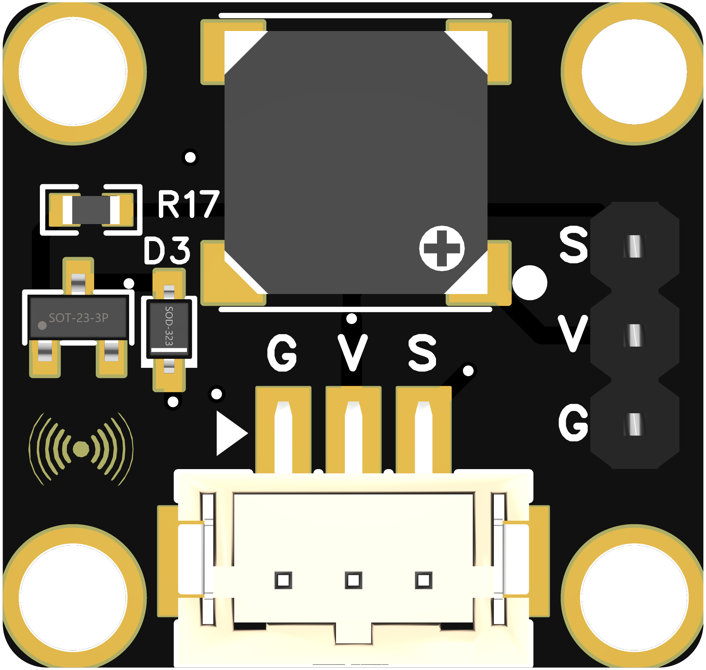

```cpp

// 定义蜂鸣器连接的引脚
#define BUZZER_PIN 6

// 音符的频率（单位：Hz）
#define NOTE_B0 31
#define NOTE_C1 33
#define NOTE_CS1 35
#define NOTE_D1 37
#define NOTE_DS1 39
#define NOTE_E1 41
#define NOTE_F1 44
#define NOTE_FS1 46
#define NOTE_G1 49
#define NOTE_GS1 52
#define NOTE_A1 55
#define NOTE_AS1 58
#define NOTE_B1 62
#define NOTE_C2 65
#define NOTE_CS2 69
#define NOTE_D2 73
#define NOTE_DS2 78
#define NOTE_E2 82
#define NOTE_F2 87
#define NOTE_FS2 93
#define NOTE_G2 98
#define NOTE_GS2 104
#define NOTE_A2 110
#define NOTE_AS2 117
#define NOTE_B2 123
#define NOTE_C3 131
#define NOTE_CS3 139
#define NOTE_D3 147
#define NOTE_DS3 156
#define NOTE_E3 164
#define NOTE_F3 174
#define NOTE_FS3 185
#define NOTE_G3 196
#define NOTE_GS3 208
#define NOTE_A3 220
#define NOTE_AS3 233
#define NOTE_B3 247

// 音符的时长（单位：毫秒）
#define WHOLE_NOTE 1000
#define HALF_NOTE 500
#define QUARTER_NOTE 250
#define EIGHTH_NOTE 125

// 音乐旋律（音符和时长的配对）
int melody[] = {
  NOTE_E3, NOTE_E3, NOTE_F3, NOTE_G3, NOTE_G3, NOTE_G3, NOTE_E3, NOTE_E3,
  NOTE_E3, NOTE_E3, NOTE_E3, NOTE_D3, NOTE_D3, NOTE_E3, NOTE_E3, NOTE_E3
};

int noteDurations[] = {
  EIGHTH_NOTE, EIGHTH_NOTE, EIGHTH_NOTE, EIGHTH_NOTE, 
  HALF_NOTE, HALF_NOTE, EIGHTH_NOTE, EIGHTH_NOTE,
  EIGHTH_NOTE, EIGHTH_NOTE, HALF_NOTE, HALF_NOTE, 
  EIGHTH_NOTE, EIGHTH_NOTE, WHOLE_NOTE, WHOLE_NOTE
};

void setup() {
  // 设置蜂鸣器引脚为输出
  pinMode(BUZZER_PIN, OUTPUT);
}

void loop() {
  // 播放旋律
  for (int thisNote = 0; thisNote < 16; thisNote++) {
    int noteDuration = noteDurations[thisNote];
    int note = melody[thisNote];

    // 播放当前音符
    tone(BUZZER_PIN, note, noteDuration);

    // 为了使音符不会重叠，我们添加一点延时
    int pauseBetweenNotes = noteDuration * 1.30;
    delay(pauseBetweenNotes);
  }

  // 旋律播放完后暂停一段时间
  delay(1000);
}


```