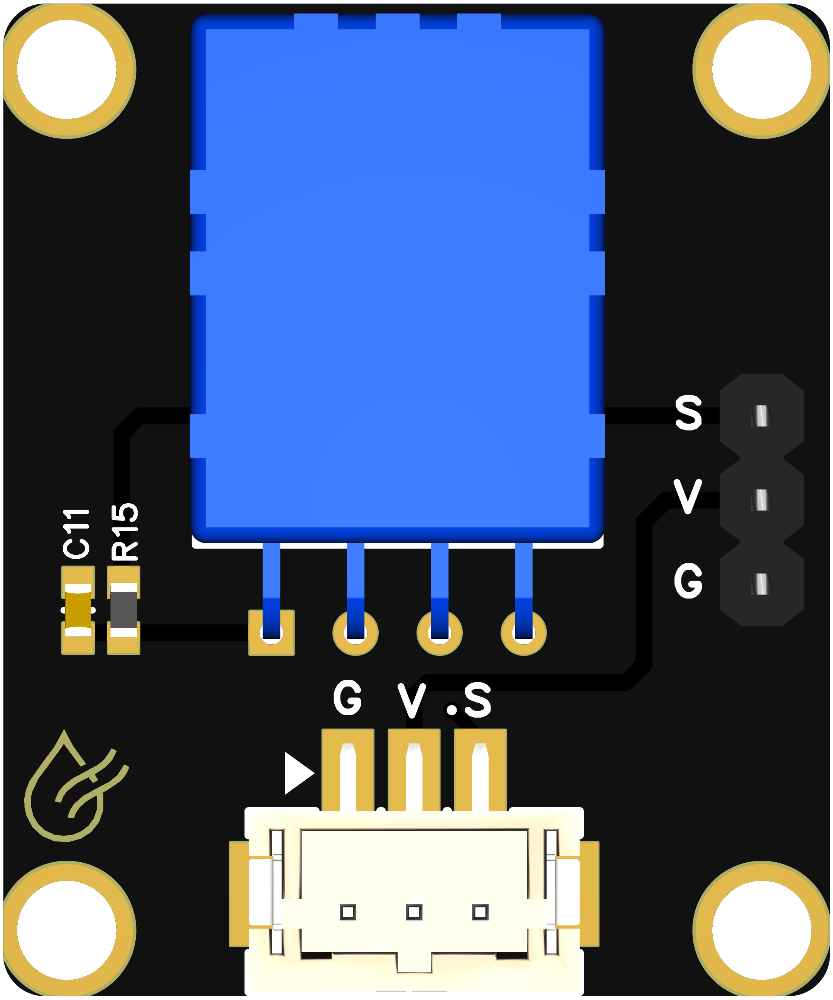

```cpp

/**
 * DHT11 Temperature Reader
 * This sketch reads temperature data from the DHT11 sensor and prints the value to the serial port.
 * It also handles potential error states that might occur during reading.
 *
 * Author: Dhruba Saha
 * Version: 2.1.0
 * License: MIT
 */

// Include the DHT11 library for interfacing with the sensor.
#include <DHT11.h>

// Create an instance of the DHT11 class.
// - For Arduino: Connect the sensor to Digital I/O Pin 2.
// - For ESP32: Connect the sensor to pin GPIO2 or P2.
// - For ESP8266: Connect the sensor to GPIO2 or D4.
DHT11 dht11(6);

void setup() {
    // Initialize serial communication to allow debugging and data readout.
    // Using a baud rate of 9600 bps.
    Serial.begin(9600);
    
    // Uncomment the line below to set a custom delay between sensor readings (in milliseconds).
    // dht11.setDelay(500); // Set this to the desired delay. Default is 500ms.
}

void loop() {
    // Attempt to read the temperature value from the DHT11 sensor.
    int temperature = dht11.readTemperature();

    // Check the result of the reading.
    // If there's no error, print the temperature value.
    // If there's an error, print the appropriate error message.
    if (temperature != DHT11::ERROR_CHECKSUM && temperature != DHT11::ERROR_TIMEOUT) {
        Serial.print("Temperature: ");
        Serial.print(temperature);
        Serial.println(" °C");
    } else {
        // Print error message based on the error code.
        Serial.println(DHT11::getErrorString(temperature));
    }
}


```