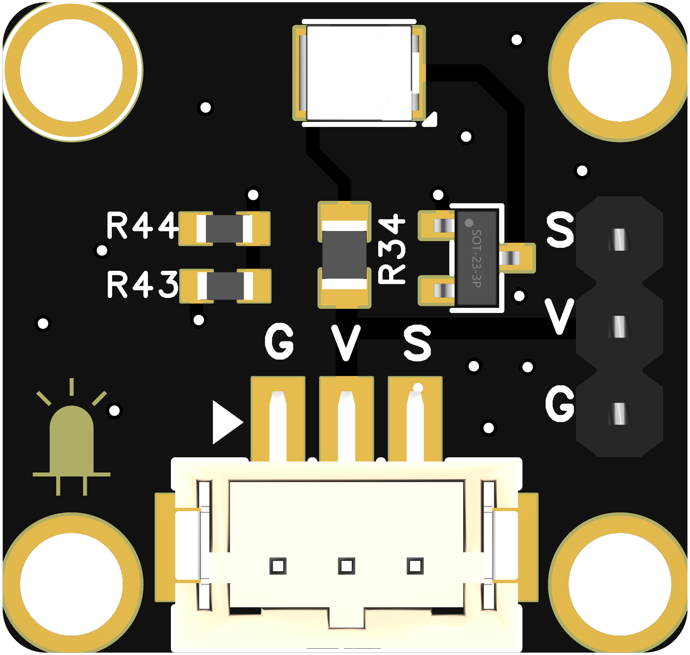

```cpp

/*
  Blink

  Turns an LED on for one second, then off for one second, repeatedly.

  Most Arduinos have an on-board LED you can control. On the UNO, MEGA and ZERO
  it is attached to digital pin 13, on MKR1000 on pin 6. LED_BUILTIN is set to
  the correct LED pin independent of which board is used.
  If you want to know what pin the on-board LED is connected to on your Arduino
  model, check the Technical Specs of your board at:
  https://www.arduino.cc/en/Main/Products

  modified 8 May 2014
  by Scott Fitzgerald
  modified 2 Sep 2016
  by Arturo Guadalupi
  modified 8 Sep 2016
  by Colby Newman

  This example code is in the public domain.

  https://www.arduino.cc/en/Tutorial/BuiltInExamples/Blink
*/
// the setup function runs once when you press reset or power the board
const int ledPins[] = {3, 6, 7, 8, 9, 10, 13, 15, 16, 17, 35,36,37,45};
const int numLeds = sizeof(ledPins) / sizeof(ledPins[0]);

void setup() 
{
  //初始化所有LED引脚为输出模式
  for (int i = 0; i < numLeds; i++) 
  {
    pinMode(ledPins[i], OUTPUT);
    digitalWrite(ledPins[i], LOW); // 确保所有LED初始状态为关闭
  }
}

void loop() 
{
  //依次点亮每个LED
  for (int i = 0; i < numLeds; i++) 
  {
    digitalWrite(ledPins[i], HIGH); // 点亮LED
    delay(10); // 延迟200毫秒
    digitalWrite(ledPins[i], LOW); // 关闭LED
  }
}

```