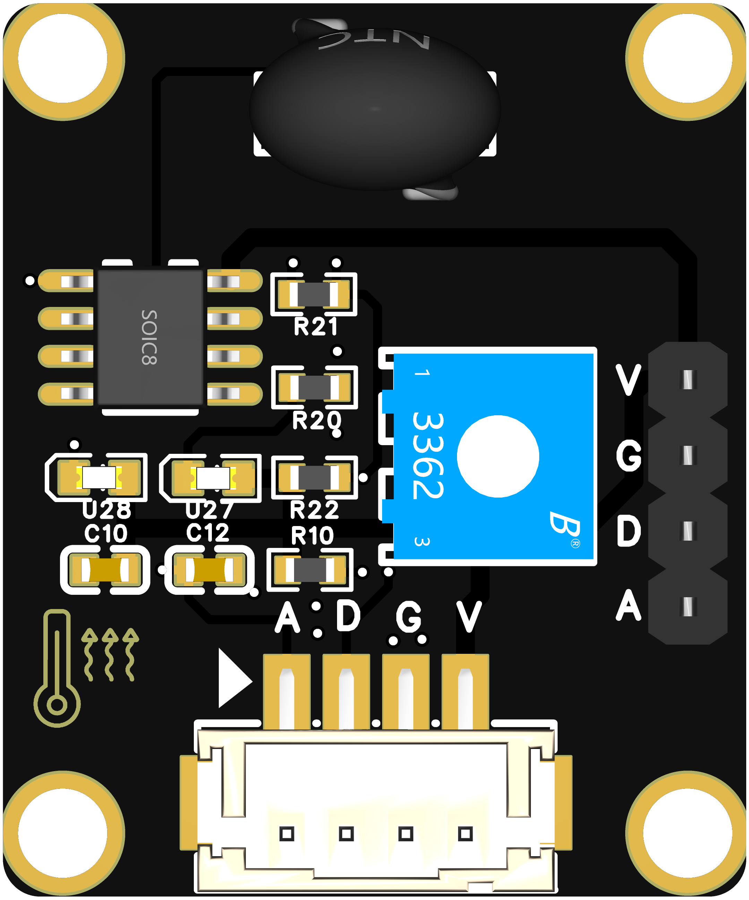

```cpp

#include <Adafruit_GFX.h>    // 核心图形库
#include <Adafruit_ST7789.h> // ST7789硬件特定的库
#include <SPI.h>              // SPI库

// ST7789 屏幕控制引脚定义
#define TFT_CS    44  // 选择信号引脚
#define TFT_RST   -1  // 复位引脚
#define TFT_DC    43  // 数据/命令选择引脚
#define TFT_MOSI  47  // 数据输出
#define TFT_SCLK  21  // 时钟输出

Adafruit_ST7789 tft = Adafruit_ST7789(TFT_CS, TFT_DC, TFT_MOSI, TFT_SCLK, TFT_RST);

// 电位器连接的 ADC 引脚
const int potPin = 13;

// 上次的 ADC 数值
int lastAdcValue = -1;

// 变化阈值，只有当 ADC 数值变化超过该阈值时才更新屏幕
const int threshold = 10;  // 阈值设定为 10（可以根据需要调整）

void setup() {
  Serial.begin(115200);

  // 初始化 ST7789 屏幕
  tft.init(240, 240);  // 初始化 240x240 分辨率的 ST7789 屏幕
  tft.setRotation(2);  // 设置屏幕旋转角度为 2（90度）

  // 清空屏幕并设置背景颜色
  tft.fillScreen(ST77XX_BLACK);

  // 启用 UTF8 支持并设置字体
  tft.setTextColor(ST77XX_WHITE);  // 设置文本颜色为白色
  tft.setTextSize(2);              // 设置字体大小

  // 设置 ADC 读取分辨率为 12 位（ESP32 默认为 12 位）
  analogReadResolution(12);

  // 显示连接的 ADC 引脚信息
  tft.setTextColor(ST77XX_CYAN);  // 设置字体颜色为青色
  tft.setTextSize(2);              // 设置字体大小
  tft.setCursor(10, 10);           // 设置光标位置
  tft.println("ADC Pin: GPIO13");
}

void clearLine(int yPos, int length) {
  tft.setCursor(10, yPos);
  for (int i = 0; i < length; i++) {
    tft.print(" ");  // 打印空格清除上一行的文本
  }
}

void loop() {
  // 从电位器引脚读取 ADC 数值，范围 0~4095
  int adcValue = analogRead(potPin);

  // 如果 ADC 数值与上次值变化超过阈值，则更新显示
  if (abs(adcValue - lastAdcValue) > threshold) {
    // 将 ADC 数值转换为电压值：0～4095 对应 0～3.3V
    float voltage = adcValue * (3.3 / 4095.0);

    // 将 ADC 数值映射到 0～270 度范围
    float angle = (adcValue * 270.0) / 4095.0;

    // 清空并更新显示 ADC 范围
    tft.fillRect(0, 40, 240, 20, ST77XX_BLACK);  // 清空上一行显示的内容
    tft.setTextColor(ST77XX_YELLOW);  // 设置字体颜色为黄色
    tft.setCursor(10, 40);  // 设置光标位置
    tft.print("ADC Range: 0 - 4095");

    // 清空并更新显示 ADC 数值
    tft.fillRect(0, 60, 240, 20, ST77XX_BLACK);  // 清空上一行显示的内容
    tft.setTextColor(ST77XX_WHITE);  // 设置字体颜色为白色
    tft.setCursor(10, 60);  // 设置光标位置
    tft.print("ADC Value: ");
    tft.println(adcValue);

    // 清空并更新显示电压范围
    tft.fillRect(0, 90, 240, 20, ST77XX_BLACK);  // 清空上一行显示的内容
    tft.setTextColor(ST77XX_GREEN);  // 设置字体颜色为绿色
    tft.setCursor(10, 90);  // 设置光标位置
    tft.print("Volt Range: 0-3.3V");

    // 清空并更新显示电压值
    tft.fillRect(0, 110, 240, 20, ST77XX_BLACK);  // 清空上一行显示的内容
    tft.setTextColor(ST77XX_WHITE);  // 设置字体颜色为白色
    tft.setCursor(10, 110);  // 设置光标位置
    tft.print("Voltage: ");
    tft.print(voltage, 2);  // 保留两位小数
    tft.println(" V");

    // 清空并更新显示角度范围
    tft.fillRect(0, 140, 240, 20, ST77XX_BLACK);  // 清空上一行显示的内容
    tft.setTextColor(ST77XX_MAGENTA);  // 设置字体颜色为品红色
    tft.setCursor(10, 140);  // 设置光标位置
    tft.print("Angle Range: 0-270");

    // 清空并更新显示角度值
    tft.fillRect(0, 160, 240, 20, ST77XX_BLACK);  // 清空上一行显示的内容
    tft.setTextColor(ST77XX_WHITE);  // 设置字体颜色为白色
    tft.setCursor(10, 160);  // 设置光标位置
    tft.print("Angle: ");
    tft.print(angle, 1);     // 保留一位小数
    tft.println(" deg");

    // 保存当前 ADC 数值，以便下次与其比较
    lastAdcValue = adcValue;
  }

  // 延时 200 毫秒，便于观察数值变化
  delay(200);
}

```
