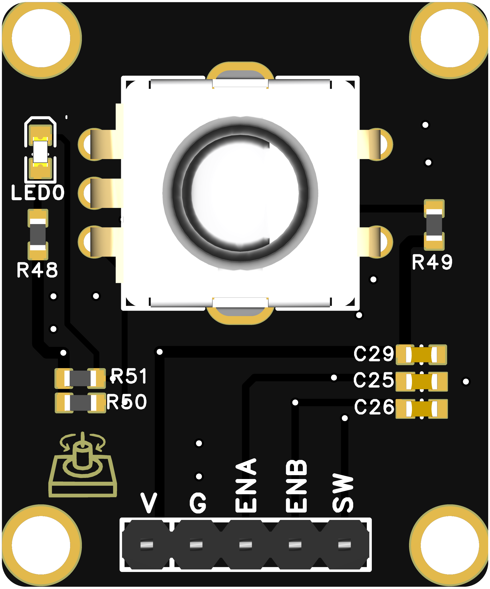

```cpp

#include <Arduino.h>
#include <ESP_Knob.h>

#define GPIO_NUM_KNOB_PIN_A     5
#define GPIO_NUM_KNOB_PIN_B     4

ESP_Knob *knob;

void onKnobLeftEventCallback(int count, void *usr_data)
{
    Serial.printf("Detect left event, count is %d\n", count);
}

void onKnobRightEventCallback(int count, void *usr_data)
{
    Serial.printf("Detect right event, count is %d\n", count);
}

void onKnobHighLimitEventCallback(int count, void *usr_data)
{
    Serial.printf("Detect high limit event, count is %d\n", count);
}

void onKnobLowLimitEventCallback(int count, void *usr_data)
{
    Serial.printf("Detect low limit event, count is %d\n", count);
}

void onKnobZeroEventCallback(int count, void *usr_data)
{
    Serial.printf("Detect zero event, count is %d\n", count);
}

void setup() {
    Serial.begin(115200);
    Serial.println("ESP_Knob example");

    knob = new ESP_Knob(GPIO_NUM_KNOB_PIN_A, GPIO_NUM_KNOB_PIN_B);

    // knob->invertDirection();
    knob->begin();
    knob->attachLeftEventCallback(onKnobLeftEventCallback);
    knob->attachRightEventCallback(onKnobRightEventCallback);
    knob->attachHighLimitEventCallback(onKnobHighLimitEventCallback);
    knob->attachLowLimitEventCallback(onKnobLowLimitEventCallback);
    knob->attachZeroEventCallback(onKnobZeroEventCallback);
}

void loop() {
    delay(1000);
}


```