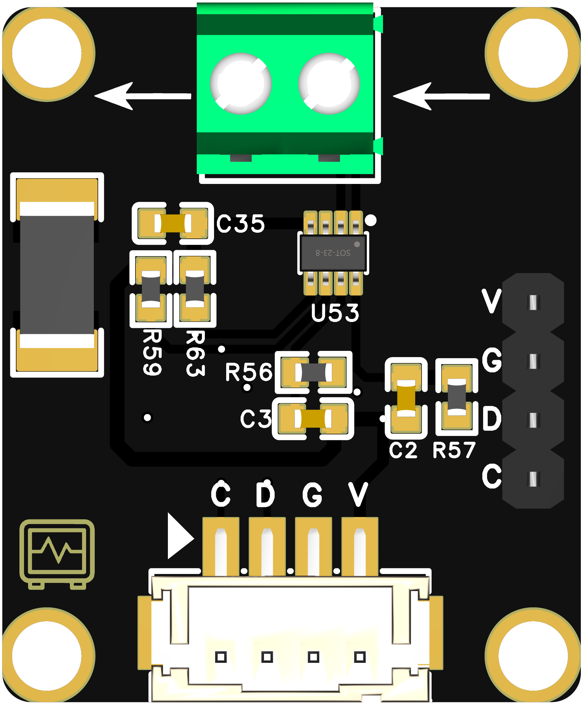

```cpp

//#include <Wire.h>
#include <Adafruit_INA219.h>

// 创建 INA219 对象
Adafruit_INA219 ina219;

// 配置 I2C 引脚
#define SDA_PIN 4  // ESP32-S3 的默认 SDA 引脚（可以根据需要修改）
#define SCL_PIN 5  // ESP32-S3 的默认 SCL 引脚（可以根据需要修改）

void setup() {
  // 初始化串口通信
  Serial.begin(115200);
  delay(2000);  // 给串口一些时间来启动

  // 初始化 I2C 通信，指定 SDA 和 SCL 引脚
  Wire.begin(SDA_PIN, SCL_PIN);

  // 初始化 INA219 传感器
  if (!ina219.begin()) {
    Serial.println("无法找到 INA219 传感器！");
    while (1);
  }

  // 输出初始化完成的提示
  Serial.println("INA219 初始化完成！");
}

void loop() {
  // 读取总线电压、电流和功率
  float busVoltage = ina219.getBusVoltage_V();    // 总线电压（伏特）
  float shuntVoltage = ina219.getShuntVoltage_mV(); // 分流电压（毫伏）
  float current = ina219.getCurrent_mA();          // 电流（毫安）
  float power = ina219.getPower_mW();              // 功率（毫瓦）

  // 打印读取的数据
  Serial.print("总线电压: "); Serial.print(busVoltage); Serial.println(" V");
  Serial.print("分流电压: "); Serial.print(shuntVoltage); Serial.println(" mV");
  Serial.print("电流: "); Serial.print(current); Serial.println(" mA");
  Serial.print("功率: "); Serial.print(power); Serial.println(" mW");

  // 每秒更新一次数据
  delay(1000);
}
aaaaa

```