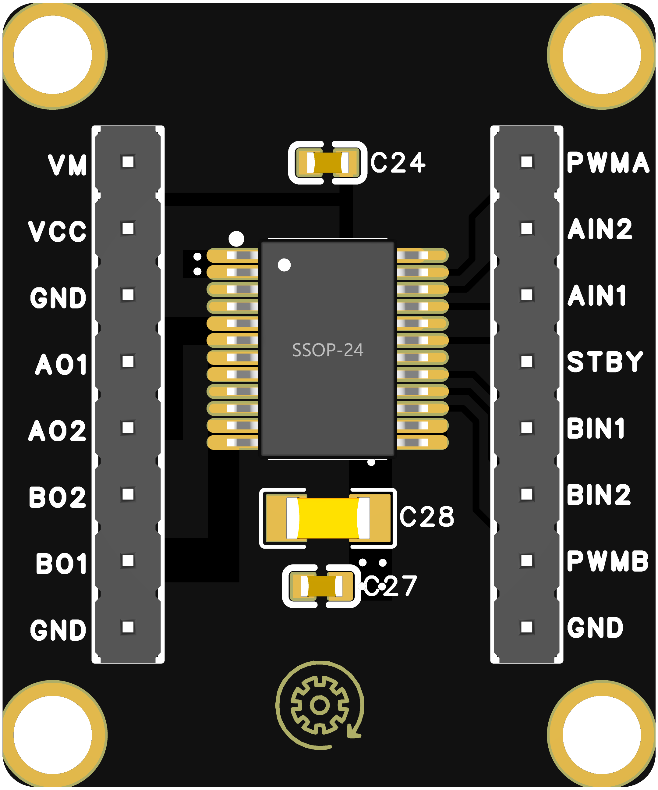

```cpp

// 定义 TB6612 控制引脚
#define PWMA   35   // 电机A的PWM控制引脚
#define AIN1   36   // 电机A的输入1
#define AIN2   37   // 电机A的输入2
#define STBY   38   // 待机控制引脚

#define PWMB   14   // 电机B的PWM控制引脚
#define BIN1   12   // 电机B的输入1
#define BIN2   13   // 电机B的输入2

void setup() {
  // 初始化电机控制引脚为输出模式
  pinMode(PWMA, OUTPUT);
  pinMode(AIN1, OUTPUT);
  pinMode(AIN2, OUTPUT);
  pinMode(STBY, OUTPUT);
  pinMode(PWMB, OUTPUT);
  pinMode(BIN1, OUTPUT);
  pinMode(BIN2, OUTPUT);

  // 初始化待机控制，解除待机模式
  digitalWrite(STBY, HIGH);  // 设置为高电平，启用电机驱动

  // 设置 PWM 频率
  ledcSetup(0, 2000, 8);  // PWM 通道0，2kHz频率，8位分辨率
  ledcAttachPin(PWMA, 0);  // 将 PWM 控制引脚 PWMA 映射到通道0
  ledcSetup(1, 2000, 8);  // PWM 通道1，2kHz频率，8位分辨率
  ledcAttachPin(PWMB, 1);  // 将 PWM 控制引脚 PWMB 映射到通道1

  // 设置电机A和电机B的初始状态
  stopMotorA();
  stopMotorB();
}

void loop() {
  // 让电机A向前转动
  forwardMotorA();
  analogWrite(PWMA, 255);  // 电机A的转速50%
  delay(2000);  // 转动2秒

  // 电机A停止
  stopMotorA();
  delay(100);

  // 让电机B向后转动
  backwardMotorB();
  analogWrite(PWMB, 255);  // 电机B的转速50%
  delay(2000);  // 转动2秒

  // 电机B停止
  stopMotorB();
  delay(100);
}

void forwardMotorA() {
  digitalWrite(AIN1, HIGH);
  digitalWrite(AIN2, LOW);
}

void backwardMotorA() {
  digitalWrite(AIN1, LOW);
  digitalWrite(AIN2, HIGH);
}

void stopMotorA() {
  digitalWrite(AIN1, LOW);
  digitalWrite(AIN2, LOW);
}

void forwardMotorB() {
  digitalWrite(BIN1, HIGH);
  digitalWrite(BIN2, LOW);
}

void backwardMotorB() {
  digitalWrite(BIN1, LOW);
  digitalWrite(BIN2, HIGH);
}

void stopMotorB() {
  digitalWrite(BIN1, LOW);
  digitalWrite(BIN2, LOW);
}


```