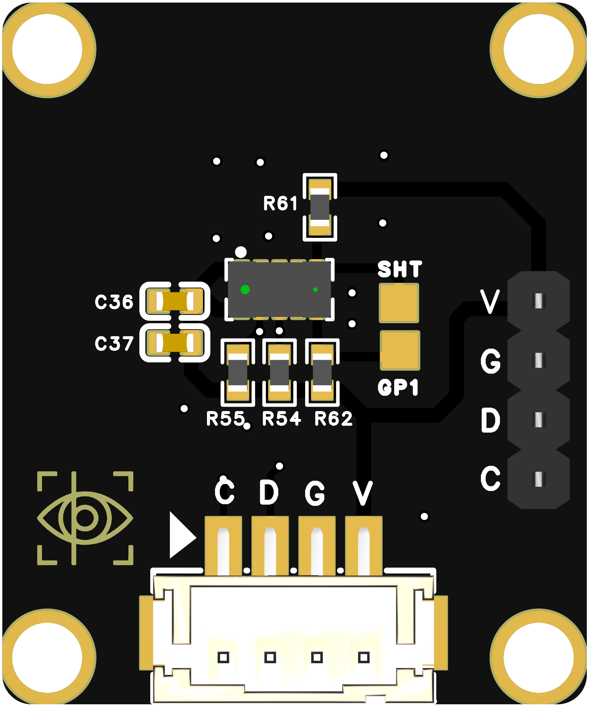

```cpp

#include <Wire.h>
#include <Adafruit_VL53L0X.h>

// 创建 VL53L0X 对象
Adafruit_VL53L0X sensor = Adafruit_VL53L0X();

void setup() {
  Serial.begin(115200);
  while (!Serial) {}

  Wire.begin(4, 5);  // ESP32-S3 I2C 引脚配置 SDA: 4, SCL: 5

  // 初始化 VL53L0X 传感器
  if (!sensor.begin()) {
    Serial.println("传感器初始化失败！请检查连接。");
    while (1); // 初始化失败，停止程序
  }

  Serial.println("传感器初始化成功！");
}

void loop() {
  // 获取距离数据（单位：毫米）
  VL53L0X_RangingMeasurementData_t measure;
  sensor.rangingTest(&measure, false);  // 进行一次测量

  // 检查是否成功获取数据
  if (measure.RangeStatus != 4) {  // 4 表示无效数据
    Serial.print("当前距离：");
    Serial.print(measure.RangeMilliMeter);
    Serial.println(" mm");
  } else {
    Serial.println("超出范围或测量失败");
  }

  delay(500);  // 每500毫秒读取一次
}


```