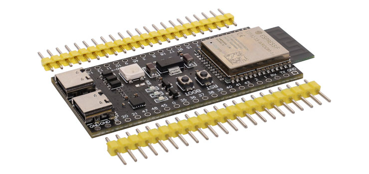
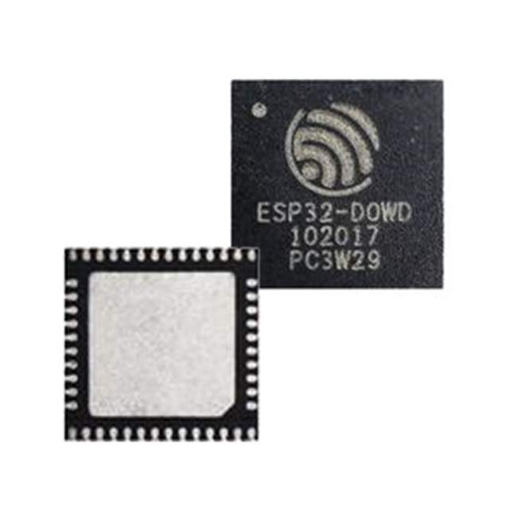
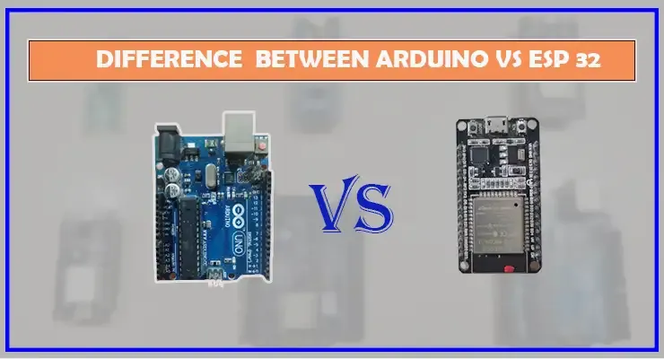
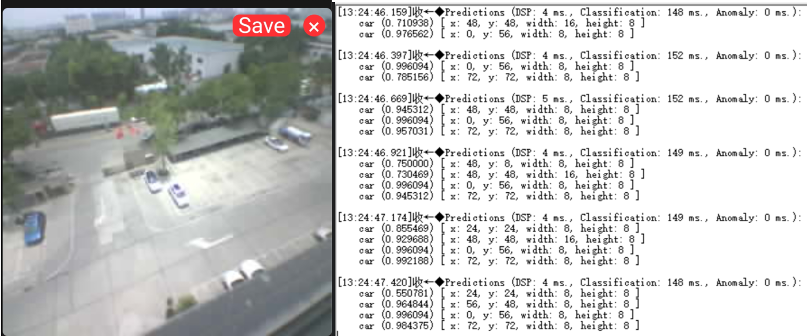
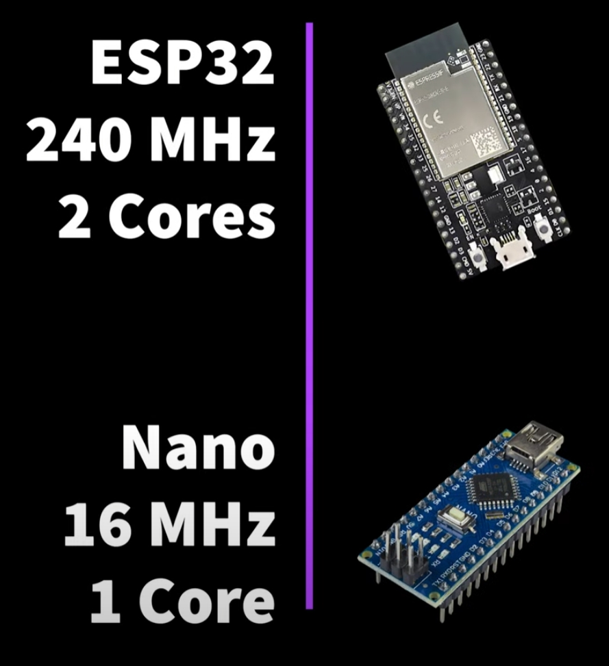
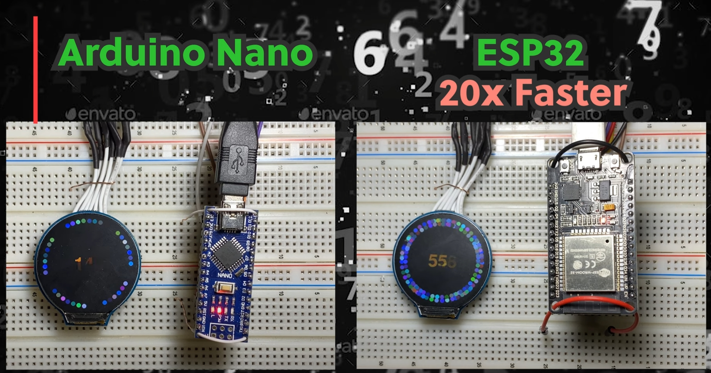

# 介绍

欢迎来到 ESP32 和 ESP32-S3 的世界！很高兴在这里见到你！

也许你还不清楚这些强大的微控制器如何彻底改变 AIoT 应用。没关系，让我们一起来探索吧。

## 什么是 ESP32 和 ESP32-S3？

<!--  -->

ESP32 和 ESP32-S3 是 **乐鑫科技（Espressif Systems）** 开发的高性能微控制器，因其 **高性能、低功耗和无线连接** 而广泛应用于物联网（IoT）。它们集成了 **Wi-Fi 和 Bluetooth（蓝牙）**，使其成为 **智能家居、工业自动化和 AI 应用** 的理想选择。

ESP32-S3 是 ESP32 系列的最新产品，提供 **AI 加速**、更多 **GPIO 引脚** 以及 **更低功耗**，非常适合边缘 AI 计算，如 **语音识别、图像处理和智能传感**。

# 为什么 Arduino 学习者应该迁移到 ESP32 和 ESP32-S3？

如果你已经熟悉 **Arduino**，并且希望探索更高性能、更多功能和更广泛的应用场景，那么 **ESP32 和 ESP32-S3** 是一个值得升级的选择。

---

## **Arduino vs. ESP32：为什么要升级？**

| **特性** | **Arduino（如 UNO、Mega）** | **ESP32 / ESP32-S3** |
|----------|-----------------|--------------|
| **核心架构** | 8-bit / 16-bit AVR | 32-bit Xtensa / RISC-V |
| **处理能力** | 16-20MHz，低算力 | 240-240MHz，多核高算力 |
| **内存** | SRAM 2KB - 8KB | RAM 512KB - 8MB |
| **无线连接** | 需要额外模块（如 ESP8266） | 内置 Wi-Fi / BLE |
| **I/O 接口** | GPIO、PWM、UART | 更多 GPIO、SPI、I2C、ADC、DAC |
| **AI 计算** | 不支持 | 支持本地 AI 推理（ESP32-S3） |
| **功耗** | 相对较高 | 低功耗模式，更适合物联网 |

---

## **为什么 Arduino 开发者应该转向 ESP32？**

### 🚀 **1. 更强的计算性能**
ESP32 拥有 **240MHz 处理能力**（Arduino UNO 仅 16MHz），可以运行更复杂的逻辑，如 **实时数据处理、信号分析、AI 推理**。

### 📡 **2. 内置 Wi-Fi 和 BLE**
ESP32 内置 **Wi-Fi 和蓝牙（BLE）**，可以直接连接到物联网平台，如 **MQTT、HTTP、AWS IoT**，而 Arduino 需要额外的 **ESP8266 或 ESP32 模块**。

### 🎯 **3. 更丰富的 I/O 资源**
ESP32 拥有 **更多 GPIO 引脚、ADC、DAC、触摸传感**，可支持 **更多传感器、显示屏、音频模块**，适用于 **复杂的嵌入式系统**。

### 🤖 **4. 低功耗，适合物联网（IoT）**
ESP32-S3 **支持深度睡眠模式（Deep Sleep）**，功耗仅 **几微安**，远低于 Arduino，适用于 **电池供电设备**。

### 🧠 **5. AIoT 计算能力**
ESP32-S3 **内置 VPU（向量处理单元）**，支持 **TensorFlow Lite for Microcontrollers**，可进行 **边缘 AI 计算、语音识别、图像处理**。

### 🎙 **6. 支持远程 AI 交互**
ESP32-S3 还能通过 **Wi-Fi 连接大模型（如 ESP32-Qwen）**，实现 **智能语音交互、AI 对话、智能家居控制**，这是 Arduino 无法实现的。

---

## **如何从 Arduino 迁移到 ESP32？**

如果你熟悉 **Arduino IDE**，可以轻松上手 **ESP32**：
1. **安装 ESP32 开发板**  
   在 Arduino IDE 中添加 **ESP32 开发板管理器**，然后选择 **ESP32-S3** 进行编程。
2. **兼容 Arduino 代码**  
   大多数 Arduino 库可直接用于 ESP32，例如 **Wire（I2C）、SPI、PWM、Serial**。
3. **学习 ESP-IDF（Espressif IoT Development Framework）**  
   高级开发者可使用 **ESP-IDF**，获得更强的控制和优化能力。

---

让我们来看看它们的关键功能。

### 无线连接

ESP32 和 ESP32-S3 均支持 **Wi-Fi（2.4GHz）和 Bluetooth（BLE 4.2/5.0）**，可轻松在 AIoT 设备间进行通信。

- **Wi-Fi**：适用于云端通信、智能家居集成和远程控制。
- **蓝牙（BLE）**：适用于低功耗物联网设备，如可穿戴设备和无线传感器。

### AI 加速（ESP32-S3）

ESP32-S3 具备 **向量处理单元（VPU）**，优化了 AI 计算，如：

- **语音识别**（例如唤醒词检测、语音控制）
- **图像识别**（例如物体检测、人脸识别）
- **机器学习推理**（支持 **TensorFlow Lite for Microcontrollers**）

这使得它成为 **AI 边缘计算** 的强大选择。

### AIoT 中的边缘计算

随着 **实时 AI 计算需求的增长**，ESP32 和 ESP32-S3 可在本地设备上运行 AI 任务，而无需依赖云端计算。其优势包括：

- **低延迟**：可实时处理数据，适用于 **手势识别** 和 **智能安防摄像头**。
- **增强隐私**：数据保存在设备本地，减少隐私泄露风险。
- **降低云计算成本**：减少对昂贵云计算资源的依赖。

---

## ESP32-S3 如何接入远端大模型（ESP32-Qwen）

ESP32-S3 **不仅具备本地 AI 计算能力**，还可以通过 **Wi-Fi 接入远程大模型**（如 **ESP32-Qwen**）进行智能语音交互，使 AIoT 设备具备更强的推理能力和自然语言处理（NLP）能力。

### **ESP32-Qwen：基于大模型的智能语音交互**

**ESP32-Qwen** 是基于 **阿里巴巴通义千问（Qwen）** 的 AI 语音交互解决方案，可部署在 **ESP32-S3** 上，并通过 **Wi-Fi 接入云端大模型**。其主要特点包括：

- **超低功耗语音交互**：ESP32-S3 仅负责 **本地唤醒、关键词识别**，将复杂的语音处理任务交由 **远端大模型** 执行，极大降低本地算力消耗。
- **自然语言理解（NLU）**：支持语音命令解析、对话管理、知识问答等，使 AIoT 设备具备更智能的交互体验。
- **边缘计算与云端 AI 结合**：ESP32-S3 可处理 **本地传感数据**，将复杂计算（如 **语音识别、情感分析、任务执行**）交由 **云端大模型** 完成，优化处理效率。

---

## ESP32 在 AIoT 中的应用场景

- **智能家居**：语音控制智能家电、智能语音安防
- **智能医疗**：语音交互健康助手、远程医疗问诊
- **工业物联网（IIoT）**：语音操控设备、AI 预测维护
- **智能车载系统**：语音导航、车内语音控制
- **智能教育**：AI 互动学习、语音阅读助手

## 为什么选择 ESP32？

| **特性** | **ESP32-S3 + 远程大模型（ESP32-Qwen）** | **传统 AIoT 方案** |
|----------|--------------------------------|----------------|
| **功耗** | 低功耗，本地仅唤醒，云端处理 | 需本地运行大模型，耗电高 |
| **计算能力** | 云端 AI 扩展，性能更强 | 受限于 MCU 本地计算 |
| **成本** | ESP32-S3 低成本 + AI API | 需要更强 MCU（如 Raspberry Pi） |
| **体验** | 语音识别精准，持续优化 | 受限于本地 AI 算法 |

## 如何开始使用 ESP32？

要开始基于 ESP32 或 ESP32-S3 进行 AIoT 开发，你需要：

- **开发板**：[ESP32 DevKit](https://www.espressif.com/en/products/socs/esp32) 或 [ESP32-S3 DevKit](https://www.espressif.com/en/products/socs/esp32-s3)
- **开发软件**：
  - 安装 [ESP-IDF（Espressif IoT Development Framework）](https://docs.espressif.com/projects/esp-idf/en/latest/)
  - 使用 **MicroPython** 或 **Arduino IDE** 进行快速开发
  - 运行 **TensorFlow Lite for Microcontrollers** 进行 AI 推理
- **常用外设**：
  - **ESP32-CAM（用于图像识别）**
  - **I2S 麦克风（用于语音识别）**
  - **电机、继电器、OLED 显示屏**

ESP32-S3 + ESP32-Qwen **让 AIoT 设备具备云端 AI 计算能力**，极大增强了 **语音交互、边缘计算和智能控制**。结合低功耗、低成本和高扩展性，这种架构将成为未来 **智能家居、智慧医疗、工业自动化、智能车载** 等领域的重要技术方向。

🚀 **ESP32-S3 在 AIoT 领域的未来，值得期待！**
